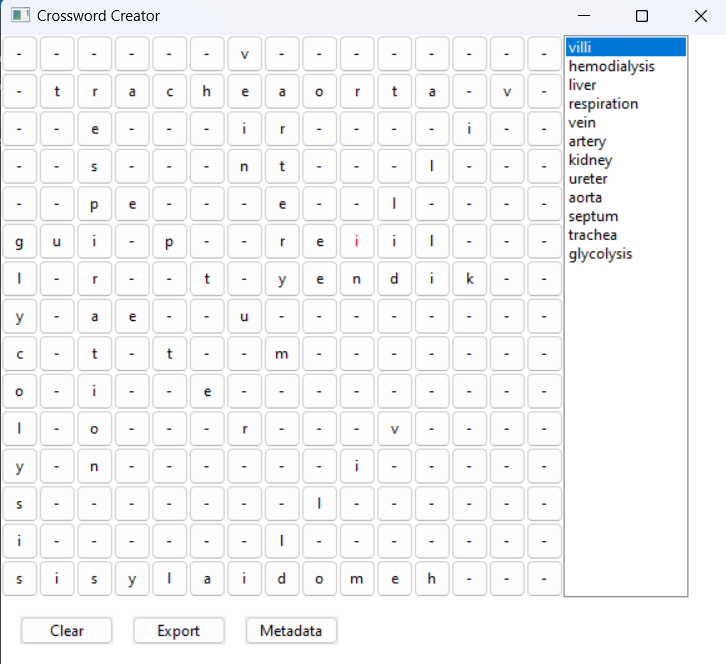

# Crossword Creator

## This project was made to ease the effort of creating crossword puzzles for future projects. It utilises a simple graphical user interface, with the help of wxPython, to communicate with the user. This utility currently provides the ability to design and export crossword puzzles in the form of images.

